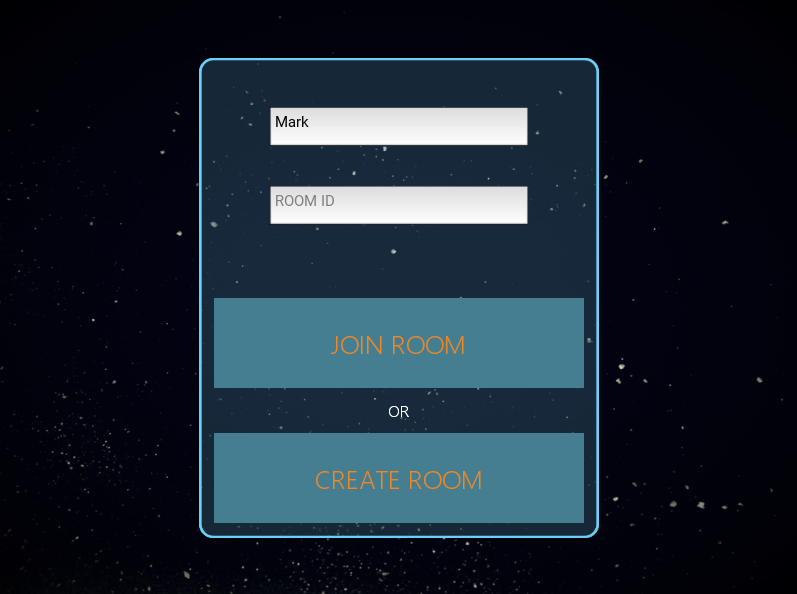
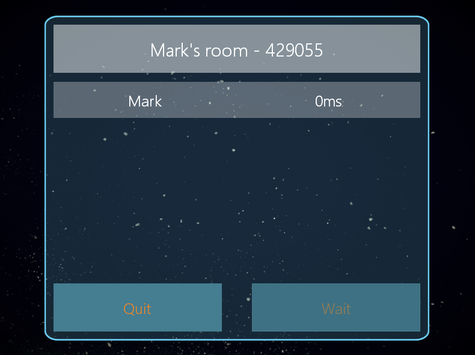

# SPACE COMBAT - Online Multiplayer Game

Space Combat is a 2D shooter game prototype, made in Kivy, which implements a network for multiplayer online gaming.

Version: 0.1

### Builded with:

- Kivy: App multiplataform (client side)
- Django: Server side
- Django REST: API which manage authentication, game rooms and players temporary profile
- Easysocket: Handle TCP and UDP connections, used by the network (authorial)
- Google's Protocol Buffer: Used by the network for fast data transference

### Game Images

### Coming in next updates

- Server:
    - Network otimization
    - Html stats page to monitor open rooms
- APP:
    - Game HUD
    - New Ships
    - New weapons with different projectile behaviors
    - Game features:
        - Map obstacles
        - Weapons to pickup

### Requirements

You can use `pip install -r requirements.txt`

- numpy
- Slumber - Used to consume the server API (app only)
- Kivy - Only the App
    - [Website](https://kivy.org/)
    - [Documentation](https://kivy.org/docs/)
    - [Github](https://github.com/kivy/kivy)
- Django - Only the Server
    - [Website](https://www.djangoproject.com/)
    - [Documentation](https://docs.djangoproject.com/en/2.1/)
    - [Github](https://github.com/django/django)
- Django REST Framework - Only the Server
    - [Documentation](http://www.django-rest-framework.org/)
    - [Github](https://github.com/encode/django-rest-framework)
- Protocol Buffers - Used in the network (app and server)
    - [Website and Documentation](https://developers.google.com/protocol-buffers/)
    - [Github](https://github.com/protocolbuffers/protobuf/releases)
- SciPy - Used in the game logic (app and server)
    - [Website and Documentation](https://www.scipy.org/)

### Related projects

This project use other authorial projects:

- Custom Widgets for Kivy - [see on GitHub](https://github.com/yuriharrison/custom-widgets)
- Easysocket - [see on GitHub](https://github.com/yuriharrison/easysocket)

## License

This project is licensed under the MIT License - see the [LICENSE](LICENSE) file for details

__Dependencies__

- [Kivy Licence](https://github.com/kivy/kivy/blob/master/LICENSE) - Only the client side
- [Django](https://www.djangoproject.com/trademarks/) - Only the server side
- [Django REST](http://www.django-rest-framework.org/#license) - Only the server side
- [Protocol Buffer](https://github.com/protocolbuffers/protobuf/blob/master/LICENSE) - Used by the network (client and server side)